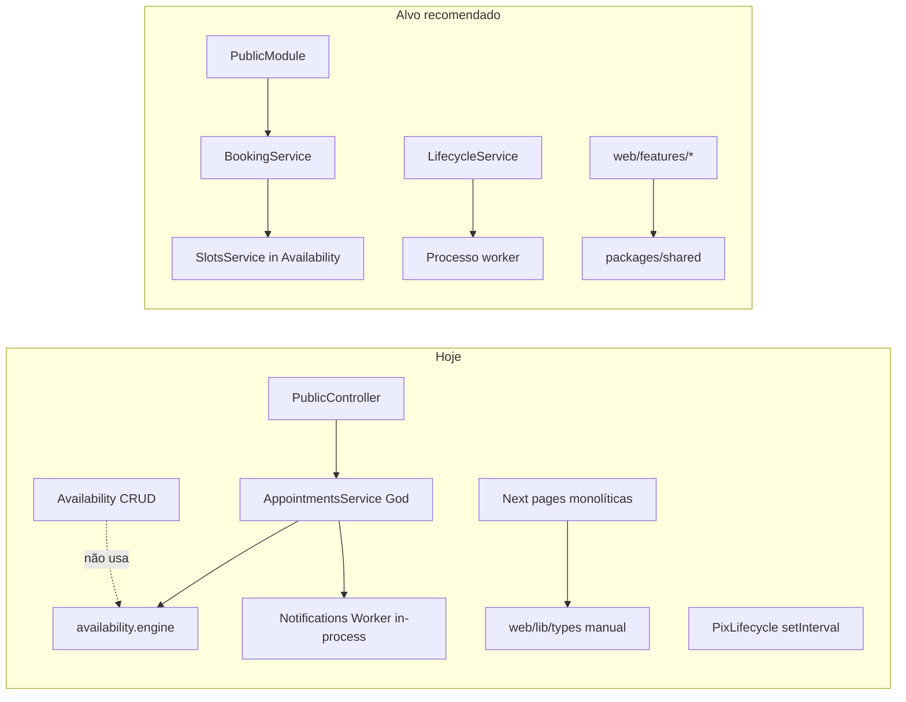

# Agenda Pro — Architecture Review

**Data:** 2026-08-09  
**Escopo:** monorepo (`apps/api`, `apps/web`), camadas Nest/Next, acoplamento, coesão, SOLID, DDD leve, duplicação, responsabilidades.  
**Método:** leitura do código real + cruzamento com `docs/ARCHITECTURE.md`, `AUDIT.md`, `FINAL-AUDIT.md` (docs não copiados cegamente).  
**Restrição desta entrega:** nenhum código de produto alterado; único artefato = este arquivo.

---

## Resumo executivo

A API NestJS está organizada em módulos por domínio de negócio (auth, appointments, billing, clients, payments…) com controllers majoritariamente finos e alguns núcleos de domínio puros bem isolados (`appointment-state`, `availability.engine`, `plan-entitlements`, `client-segment`, `loyalty-credit`). O multi-tenant é consistente no padrão `where: { id, tenantId }`.

O principal risco estrutural é a concentração de responsabilidade em `AppointmentsService` (~809 linhas), que absorve booking público, slots, perfil público + cache, manage-by-token, depósito PIX e efeitos colaterais (waitlist/loyalty/notifications). No frontend, páginas client-side monolíticas (ex.: booking público ~815 linhas) misturam UI, estado e contrato HTTP. O monorepo declara `packages/*` mas a pasta está ausente — contratos FE/API divergem (ex.: `PixChargeStatus` sem `REFUNDED`). Workers BullMQ e reconciliação PIX rodam in-process na API; `docs/ARCHITECTURE.md` afirma que o compose “prevê worker separado”, mas `docker-compose.prod.yml` não tem serviço `worker`.

**Nota geral de arquitetura: 6.5 / 10**

---

## Nota (0–10)

| Dimensão | Nota | Comentário |
|----------|------|------------|
| Separação de camadas Nest (controller/service) | 7.5 | Controllers finos na maioria; exceção Reviews |
| Coesão de módulos / SRP | 5.0 | Appointments + páginas web gordas |
| Acoplamento entre módulos | 6.5 | Imports Nest explícitos; pouco `forwardRef`; acoplamento via Prisma/efeitos |
| Contratos compartilhados (monorepo) | 4.0 | `packages/*` vazio; types manuais no web |
| DDD leve (regras de domínio) | 7.0 | FSM, engine, entitlements, segment, loyalty-credit |
| Escalabilidade de processos | 5.5 | Worker + PIX timer no processo HTTP |
| Frontend (camadas / feature folders) | 5.0 | App Router ok; sem features; pages monolíticas |
| **Agregado** | **6.5** | Base sólida de SaaS MVP com dívida concentrada |

---

## Lista priorizada de problemas

### 1. `AppointmentsService` como God Object do domínio agenda + superfície pública

| Campo | Conteúdo |
|-------|----------|
| **Gravidade** | CRÍTICO |
| **Categoria** | Arquitetura / SRP / coesão |
| **Localização** | `apps/api/src/appointments/appointments.service.ts` (~809 linhas); `apps/api/src/appointments/appointments.module.ts`; `apps/api/src/public/public.controller.ts` |
| **Problema** | Um único service concentra listagem autenticada, FSM/status, perfil público + cache, slots, `bookPublic` (lock/overlap/limite/plano/PIX), manage-by-token (get/confirm/cancel/reschedule/review), depósito Mercado Pago e side-effects (notifications, waitlist, loyalty). O `PublicController` vive no `AppointmentsModule` e delega quase tudo a esse service. |
| **Impacto** | Mudanças em booking, PIX, cache público ou manage link colidem no mesmo arquivo; testes e revisão ficam caros; viola Single Responsibility e dificulta extrair bounded contexts (Scheduling vs Public Catalog vs Client Self-Service). |
| **Evidência** | Métodos públicos no service: `list`, `updateStatus`, `getPublicProfile`, `invalidatePublicProfileCache`, `getPublicSlots`, `bookPublic`, `getByManageToken`, `confirmByToken`, `cancelByToken`, `rescheduleByToken`, `reviewByToken`. Module registra `PublicController` + importa `NotificationsModule`, `PaymentsModule`, `WaitlistModule`, `LoyaltyModule`. `bookPublic` (≈L413–580) mistura validação de slot, TX Prisma, waitlist `BOOKED`, PIX e notifications. |
| **Solução** | Partir em services/módulos: `PublicCatalogService` (profile/slots/cache), `BookingService` (book + anti-double-book), `AppointmentLifecycleService` (status/FSM/dashboard), `ManageTokenService` (self-service). Manter `appointment-state` e `availability.engine` como domínio puro. Opcional: módulo `PublicModule` dono do `PublicController`. |
| **Esforço** | Grande |

---

### 2. Monorepo sem `packages/*` — contratos FE/API manuais e drift

| Campo | Conteúdo |
|-------|----------|
| **Gravidade** | ALTO |
| **Categoria** | Arquitetura / monorepo / contratos |
| **Localização** | `package.json` (`workspaces: ["apps/*","packages/*"]`); pasta `packages/` **ausente** na raiz; `apps/web/src/lib/types.ts` (~385 linhas) |
| **Problema** | Workspaces reservam packages compartilhados, mas não há pacote `@agenda-pro/shared` (ou similar). O web redeclara enums/DTOs à mão. Já há drift comprovado vs Prisma. |
| **Impacto** | Breaking changes da API (ex.: Fase 7 paginação) dependem de sincronização manual; tipos mentem; risco de UI tratar status inválidos como impossíveis. |
| **Evidência** | `dir packages` vazio/inexistente. `docs/ARCHITECTURE.md` diz `packages/ (reservado)`. Em `types.ts`: `PixChargeStatus = 'PENDING' \| 'PAID' \| 'EXPIRED' \| 'CANCELLED'` — **sem `REFUNDED`**. Em `schema.prisma` L430–436 o enum inclui `REFUNDED` (Fase 4). Comentário em `LoginResponse` (`types.ts` L36–37): “Tokens ainda vêm no body…” — desatualizado vs `auth.controller.ts` L72–73 / L82 (body só `user`/`tenant`). |
| **Solução** | Criar `packages/shared` (Zod/TS) ou gerar OpenAPI → client TS; exportar enums alinhados ao Prisma; remover placeholders/comentários obsoletos do web. |
| **Esforço** | Médio |

---

### 3. Processos de background acoplados ao processo HTTP da API

| Campo | Conteúdo |
|-------|----------|
| **Gravidade** | ALTO |
| **Categoria** | Arquitetura / deploy / escalabilidade |
| **Localização** | `apps/api/src/notifications/notifications.service.ts`; `apps/api/src/payments/pix-lifecycle.service.ts`; `docker-compose.prod.yml`; `docs/ARCHITECTURE.md` |
| **Problema** | BullMQ `Worker` sobe no `NotificationsService` (mesmo processo Nest). `PixLifecycleService` usa `setInterval` (60s) no `onModuleInit` da API. Documentação afirma compose “pronto” para worker separado; o compose prod **não** define serviço `worker`. |
| **Impacto** | Escalar HTTP multiplica workers/reconciles (corridas / carga duplicada) ou, com uma réplica, HTTP e fila compartilham CPU/memória e falham juntos. Deploy/restart de API interrompe fila e reconciliação PIX. |
| **Evidência** | `notifications.service.ts` L41–46: `new Queue` + `new Worker` no bootstrap. `pix-lifecycle.service.ts` L27–35: `setInterval(...reconcileExpired...)`. `docker-compose.prod.yml`: só `postgres`, `redis`, `api`, `web` — sem `worker`. `docs/ARCHITECTURE.md` L100: “compose prevê worker separado (pedido B-13)” — **não verificado no compose atual**. `INFRA-ENGINEERING-REQUESTS.md` L21 descreve intenção futura, não implementação. |
| **Solução** | Entrypoint `worker.ts` (só filas + reconcile); serviço Compose `worker` na mesma imagem; HTTP sem `Worker`/`setInterval` (feature flag ou módulos condicionais). |
| **Esforço** | Médio |

---

### 4. Frontend sem camadas de feature — páginas monolíticas client-side

| Campo | Conteúdo |
|-------|----------|
| **Gravidade** | ALTO |
| **Categoria** | Arquitetura / frontend / coesão |
| **Localização** | `apps/web/src/app/u/[slug]/page.tsx` (~815 linhas); `apps/web/src/app/agendamento/[token]/page.tsx` (~485); `apps/web/src/app/dashboard/clients/page.tsx` (~672); `apps/web/src/lib/` só `api.ts`, `auth.ts`, `format.ts`, `types.ts` |
| **Problema** | Quase todas as rotas são `'use client'` com fetch, estado, formulários e UI no mesmo arquivo. Não há pastas `features/`, hooks de domínio, nem componentes de fluxo de booking separados. Design system em `components/ui.tsx` é o único “layer” reutilizável significativo. |
| **Impacto** | Difícil testar fluxos (booking wizard, CRM) isolados; regressões de UX; App Router pouco explorado (quase zero Server Components / data fetching no servidor). |
| **Evidência** | Contagem de linhas das pages acima; `u/[slug]/page.tsx` L1 `'use client'` + imports de `api`/`types` + wizard multi-step no mesmo arquivo; ausência de `apps/web/src/features` ou `hooks/` além de libs mínimas. |
| **Solução** | Extrair `BookingWizard`, `ManageAppointment`, `ClientsCrm` em features; hooks `usePublicProfile` / `useBook`; manter pages finas. Gradualmente Server Components onde não houver estado. |
| **Esforço** | Grande |

---

### 5. Domínio de disponibilidade partido — CRUD sem engine; slots no Appointments

| Campo | Conteúdo |
|-------|----------|
| **Gravidade** | MÉDIO |
| **Categoria** | Arquitetura / coesão / DDD leve |
| **Localização** | `apps/api/src/availability/*`; `apps/api/src/common/availability/availability.engine.ts`; uso em `appointments.service.ts` |
| **Problema** | `AvailabilityModule` só persiste regras/exceções. O cálculo de slots (`computeDaySlots`, overlap, etc.) é usado pelo fluxo público/booking dentro de Appointments, não pelo módulo Availability. Coesão do bounded context “Availability” fica fragmentada. |
| **Impacto** | Quem altera regras de grade/buffer precisa conhecer Appointments; AvailabilityModule não exporta o comportamento que o nome sugere. |
| **Evidência** | `availability.service.ts`: CRUD Prisma apenas. `appointments.service.ts` importa `computeDaySlots`, `hasOverlap`, `ACTIVE_APPOINTMENT_STATUSES` do engine e implementa `getPublicSlots` / `computeSlotsFor`. `AvailabilityModule` não importa/exporta o engine. |
| **Solução** | `AvailabilityEngine` + `SlotsService` no `AvailabilityModule` (exportado); Appointments/Booking só orquestra. |
| **Esforço** | Médio |

---

### 6. Helpers multi-tenant documentados mas mortos no runtime

| Campo | Conteúdo |
|-------|----------|
| **Gravidade** | MÉDIO |
| **Categoria** | Arquitetura / inconsistência / falsa abstração |
| **Localização** | `apps/api/src/common/tenant/tenant-scope.ts`; `tenant-scope.spec.ts` |
| **Problema** | `assertTenantOwnership` e `tenantWhere` existem e têm testes, mas **nenhum** service/controller de produção os importa. O isolamento real é ad-hoc (`findFirst({ where: { id, tenantId } })`), o que funciona, porém a abstração “oficial” não governa o código. |
| **Impacto** | Novos contribuidores podem achar que o helper é a barreira de segurança; cobertura de teste do helper não reduz risco de query esquecida sem `tenantId`. |
| **Evidência** | Ripgrep de `assertTenantOwnership`/`tenantWhere` em `apps/api/src`: matches **somente** em `tenant-scope.ts` e `tenant-scope.spec.ts`. Docs (`docs/ARCHITECTURE.md` L39) pedem filtro por `tenantId` — padrão cumprido manualmente, não via helper. |
| **Solução** | Adotar o helper (ou Prisma middleware/extension `tenantId`) em todos os repositórios **ou** remover o dead code e documentar a convenção `where: { id, tenantId }`. |
| **Esforço** | Pequeno–Médio |

---

### 7. Fronteiras de módulo inconsistentes (DTO/Reviews/Loyalty)

| Campo | Conteúdo |
|-------|----------|
| **Gravidade** | MÉDIO |
| **Categoria** | Arquitetura / ownership / camadas |
| **Localização** | `apps/api/src/waitlist/waitlist.service.ts` ← DTO em `appointments/dto/appointment.dto.ts`; `apps/api/src/reviews/reviews.controller.ts`; `apps/api/src/loyalty/*` (não listado em `AppModule`) |
| **Problema** | (a) `JoinWaitlistDto` vive no DTO de appointments mas é usado por Waitlist. (b) `ReviewsModule` injeta `PrismaService` + cache **no controller** — sem service (quebra o padrão das outras features). (c) Loyalty é módulo real mas só entra via import de Appointments, sem superfície própria no `AppModule` (ok se intencional, mas domínio “CRM/loyalty” fica invisível na composição raiz). |
| **Impacto** | Ownership confuso; Reviews mais difícil de testar/reusar; crescimento de loyalty (redeem B-11) sem home clara na composição. |
| **Evidência** | `waitlist.service.ts` L4: `import { JoinWaitlistDto } from '../appointments/dto/appointment.dto'`. `reviews.controller.ts` L24–75: lógica Prisma + invalidate no controller; `reviews.module.ts` só `controllers`. `app.module.ts`: sem `LoyaltyModule`; `appointments.module.ts` L11 importa `LoyaltyModule`. |
| **Solução** | Mover DTOs para o módulo dono; extrair `ReviewsService`; registrar/exportar Loyalty de forma explícita quando houver API de redeem. |
| **Esforço** | Pequeno |

---

### 8. Acoplamento transversal por cache Redis espalhado (sem evento de domínio)

| Campo | Conteúdo |
|-------|----------|
| **Gravidade** | MÉDIO |
| **Categoria** | Arquitetura / acoplamento |
| **Localização** | `RedisCacheService` + callers em settings, services, team, reviews, appointments |
| **Problema** | Invalidação do perfil público está espalhada (cada mutação conhece a chave de cache). Não há evento interno (`PublicProfileChanged`) — knowledge do cache vaza para vários módulos. |
| **Impacto** | Novo campo no perfil público exige lembrar N call sites; risco de cache stale se um write esquecer invalidate. |
| **Evidência** | Invalidate em `settings.service.ts` L46/56, `services.service.ts` L69, `team.service.ts` L73/115, `reviews.controller.ts` L68, `appointments.service.ts` L878 (+ wrapper L279). |
| **Solução** | EventEmitter/outbox leve ou método único `PublicProfileWriter` usado por settings/services/team/reviews; ou TTL-only aceito explicitamente. |
| **Esforço** | Médio |

---

### 9. Preços de plano duplicados no frontend (fonte de verdade ambígua)

| Campo | Conteúdo |
|-------|----------|
| **Gravidade** | BAIXO |
| **Categoria** | Arquitetura / duplicação |
| **Localização** | `apps/web/src/lib/format.ts` `PLAN_PRICE_PLACEHOLDERS`; uso em `planos/page.tsx`, `dashboard/billing/page.tsx` |
| **Problema** | API já pode expor `priceCentsMonthly`; web mantém placeholders locais como fallback — segunda fonte de verdade comercial. |
| **Impacto** | Marketing/billing podem divergir se a API mudar preços e o fallback permanecer. |
| **Evidência** | `format.ts` L55–60; `planos/page.tsx` L20–38 / L92; `AUDIT.md`/Fase 4 já sinalizou remoção dos placeholders. |
| **Solução** | Remover placeholders; falhar fechado / skeleton se API não enviar preço. |
| **Esforço** | Pequeno |

---

### 10. Documentação de arquitetura parcialmente desatualizada vs código

| Campo | Conteúdo |
|-------|----------|
| **Gravidade** | BAIXO |
| **Categoria** | Arquitetura / docs |
| **Localização** | `docs/ARCHITECTURE.md`; claims em `AUDIT.md` / `FINAL-AUDIT.md` sobre compose worker |
| **Problema** | Diagrama e tabela de escala descrevem intenção (packages, worker no compose) como se existissem. |
| **Impacto** | Onboarding e decisões de ops baseados em estado desejado, não real. |
| **Evidência** | `ARCHITECTURE.md` L29 `packages/ (reservado)` + L100 worker no compose; verificação: sem `packages/`, sem service `worker` no `docker-compose.prod.yml`. |
| **Solução** | Atualizar docs para “não implementado”; checklist B-13 explícito. |
| **Esforço** | Pequeno |

---

## Pontos fortes (com evidência)

1. **Módulos Nest por domínio de negócio** — `AppModule` importa Auth, Appointments, Availability, Billing, Clients, Payments, Waitlist, Settings, Team, Reports, Reviews, Account, Health (`app.module.ts`). Fronteiras legíveis para um SaaS desse tamanho.

2. **Controllers finos no caminho feliz** — ex.: `appointments.controller.ts` só delega `list` / `updateStatus` ao service; `main.ts` com `ValidationPipe` whitelist + Helmet + prefixo `/api`.

3. **Núcleos de domínio puros e testáveis** — `appointment-state.ts` (FSM), `availability.engine.ts`, `billing/plan-entitlements.ts`, `clients/client-segment.ts`, `loyalty/loyalty-credit.ts` — funções sem Nest, com specs dedicadas.

4. **Sem ciclos Nest óbvios** — nenhum `forwardRef` no `src`; grafo de imports de módulos é acíclico (Appointments → Payments/Notifications/Waitlist/Loyalty).

5. **Isolamento multi-tenant na prática** — queries de mutação/leitura usam `tenantId` da sessão JWT (`findFirst({ where: { id, tenantId } })` em services como clients, services, team, appointments). Padrão alinhado a `docs/ARCHITECTURE.md` L39, mesmo sem o helper.

6. **Auth cookie-first** — `auth.controller.ts` grava httpOnly e **não** devolve JWT no body (L72–73, L82) — boa fronteira web/API.

7. **Entitlements de plano como política reutilizável** — `planAllowsPixDeposit` / `planAllowsWhatsappReminders` usados em appointments, notifications e billing (evita ifs espalhados sem nome).

---

## O que NÃO é problema (mitigações / não-achados)

| Afirmação | Evidência |
|-----------|-----------|
| “Não há monorepo / apps misturados” | Falso: `apps/api` + `apps/web` + workspaces em `package.json`. |
| “Controllers Nest estão gordos em geral” | Falso na média: Appointments/Auth/Settings seguem thin controller; a exceção clara é Reviews. |
| “Há dependência circular Nest forçando `forwardRef`” | Ripgrep `forwardRef`/`CircularDependency` em `apps/api/src`: zero matches. |
| “Prisma schema monolítico inviabiliza o produto agora” | Um `schema.prisma` (~500 linhas) é adequado ao tamanho atual; multi-file Prisma seria premature sem dor real. |
| “Falta completamente DDD/regras de domínio” | Falso: FSM, engine de slots, segmentos CRM e loyalty-credit existem e são testados. |
| “Web mistura tokens JWT em localStorage como sessão” | Mitigado: `lib/auth.ts` só guarda flag UX; `DashboardShell` sonda `/api/auth/me` (comentário A-06). |
| “Appointments dashboard API e public API estão no mesmo controller” | Separados: `AppointmentsController` (`/appointments`) vs `PublicController` (`/public`) — o problema é o **service** compartilhado, não o roteamento HTTP. |
| “Packages vazios quebram o build hoje” | `packages/*` sem pacotes não impede workspaces npm; é dívida estrutural, não build break imediato. |

---

## Mapa mental (estado atual vs alvo leve)

---

## Priorização sugerida (engineering)

| Ordem | Item | Por quê |
|-------|------|---------|
| 1 | Quebrar `AppointmentsService` | Maior custo de mudança contínua |
| 2 | `packages/shared` ou OpenAPI codegen | Para o drift FE/API |
| 3 | Worker + reconcile fora do HTTP | Escala e blast radius |
| 4 | Extrair features no web (booking/CRM) | Manutenibilidade UX |
| 5 | Reunir Availability + SlotsService | Coesão do domínio agenda |
| 6 | Limpar dead helpers / DTOs / ReviewsService | Higiene de fronteiras |

---

## Conclusão

Arquitetura **adequada a um SaaS MVP endurecido** (módulos claros, domínio puro pontual, multi-tenant e auth bem encaminhados), mas **ainda não “modular de verdade” no core de agenda/público** nem no contrato monorepo. A nota **6.5/10** reflete fundação Nest/Prisma saudável com dívida estrutural concentrada: God Service, packages ausentes, background in-process e frontend monolítico.

*Revisão baseada em código verificado em 2026-08-09; claims de docs que falharam verificação estão marcados explicitamente acima.*
