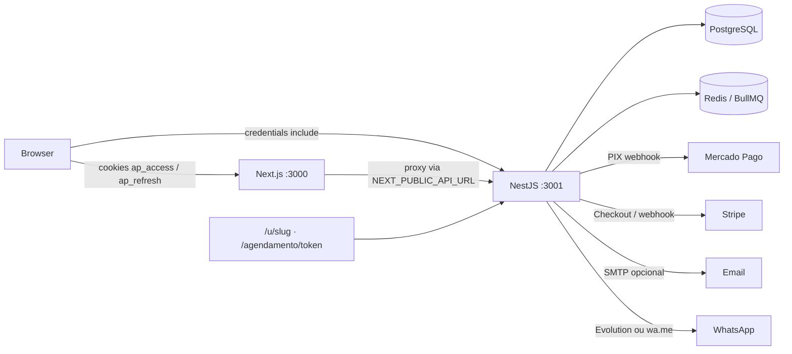

# Agenda Pro — Auditoria Completa (Fase 1)

**Data:** 2026-08-09  
**Escopo:** working tree real (staged + unstaged + untracked), sem alteração de código de produto.  
**Auditor:** Staff/Principal Engineer · Security · SaaS multi-tenant  
**Entrega:** apenas este documento.

---

## Status Fase 7

**Data implementação:** 2026-08-09  
**Validação:** `lint` + `test` (78) + `test:e2e` (5) — OK.  
**Migration:** `20260809250000_phase7_crm_metrics_index` (não toca índices Infra).

### Gargalos encontrados

| Área | Problema | Severidade |
|------|----------|------------|
| Appointments list | `take: 500` + `include` full client/service — payload grande | Alta |
| CRM `?segment=` | Filtro pós-página (total/páginas errados) | Média |
| Public profile | 3 queries PG a cada hit público (quente) | Média |
| Reports | `byProfessional` sequencial após Promise.all | Baixa |
| Client detail | `include` appointments sem `select` mínimo | Baixa |
| Waitlist list | Sem teto | Baixa |
| Índices CRM | `groupBy(clientId,status)` só com `@@index([clientId])` | Média |

### Corrigido / entregue nesta fase

| ID | Status | Notas |
|----|--------|-------|
| **Appointments pagination** | Feito | `{ items, total, page, pageSize }`; default pageSize=100, `@Max(100)`. **Breaking** vs array cru. Web dashboard/appointments lê `items` com fallback. |
| **Select mínimo** | Feito | List appointments + client detail + services list + reviews list + waitlist (`take: 200`). |
| **CRM segment** | Feito | Com `?segment=`: rank tenant (findMany leve + groupBy COMPLETED) → filtra → pagina; `total` correto. Sem segment: page-scoped (barato). |
| **Redis cache** | Feito | `RedisCacheService` TTL 60s em `GET /api/public/:slug`; invalidate em settings/services/team/reviews/reviewByToken; degrade no-op se Redis down. |
| **Reports** | Feito | `byProfessional` no mesmo `Promise.all` dos demais agregados. |
| **Índice CRM** | Feito | `appointments (tenantId, clientId, status, startsAt)` — justificado por `loadClientMetrics` / segment rank. Sem duplicar Infra. |

### Breaking changes

1. **`GET /api/appointments`** — resposta deixa de ser `Appointment[]` e passa a `{ items, total, page, pageSize }`. Query `page` / `pageSize` (max 100). Clientes que assumiam array precisam usar `.items` (web ajustado).
2. Teto efetivo cai de 500 → 100 por página (use `page` para mais).

### Benchmarks qualitativos

| Caminho | Antes | Depois |
|---------|-------|--------|
| Appointments range 14d | até 500 rows + full relations | ≤100 rows + select enxuto + `count` |
| Public profile hit | sempre 3 round-trips PG | cache hit Redis ~1 GET; miss = PG + SET EX 60 |
| CRM `?segment=vip` | total = itens da página filtrados | total = matches no tenant; páginas estáveis |
| Reports summary | 5 queries // + 2 seq | 6 // + 1 nomes serviços |

### Pendente (fora / depois)

| ID | Motivo |
|----|--------|
| **B-11** | Redeem loyalty (DEBIT) — Fase posterior |
| Trigram `clients.name` | Decisão produto (Infra já sinalizou) |
| Materialized daily summary | Só se reports crescerem |
| M-06 outbox requeue | Pedido Infra, não desta fase |
| Worker separado B-13 | Infra compose pronto; entrypoint depois |

### Arquivos principais

- `apps/api/src/common/cache/redis-cache.service.ts` (+ spec)
- `apps/api/src/common/pagination.ts` (+ spec)
- `apps/api/src/appointments/appointments.service.ts` / `dto/appointment.dto.ts`
- `apps/api/src/clients/clients.service.ts` (+ segment-rank spec)
- `apps/api/src/reports/reports.service.ts`
- `apps/api/src/settings|services|team|reviews|waitlist` (invalidate / select / take)
- `apps/api/prisma/migrations/20260809250000_phase7_crm_metrics_index`
- `apps/web/.../dashboard/page.tsx` + `appointments/page.tsx` (contrato mínimo)

### Infra

- Índices Infra preservados. Novo índice só CRM metrics. Redis AOF/health intactos.

---

## Status Fase 5

**Data implementação:** 2026-08-09  
**Validação:** `lint` + `test` (73) + `test:e2e` (5) — OK.  
**Migration:** `20260809240000_phase5_crm_loyalty` (não toca índices Infra).

### Corrigido / entregue nesta fase

| ID | Status | Notas |
|----|--------|-------|
| **CRM metrics** | Feito | `clients.service` agrega COMPLETED/CANCELLED/NO_SHOW + próximo horário via `groupBy` (page-scoped, sem N+1). Expõe ticket médio, frequência (`visitsPerMonth`), last/next visit, gasto. |
| **Segmentação** | Feito | `client-segment.ts`: `new` / `frequent` / `vip` / `inactive` / `at_risk` (prioridade documentada + unit tests). Query `?segment=` (filtro na página) e campo `segment` na list/detail. |
| **Retenção 30/60/90** | Feito | `inactiveBucket` + `GET /api/clients?inactiveDays=30\|60\|90` para campanhas futuras (sem WhatsApp spam; envio deve respeitar `marketingOptIn`). |
| **Tags / aniversário** | Feito | `Client.tags` (`String[]`) + `birthday` (`Date`); `PATCH /api/clients/:id/profile`. Notes já existiam. |
| **Consent na detail** | Feito | List/detail incluem `marketingOptIn`; UI clients toggle via `PATCH .../consent`. LGPD export/anon inclui tags/birthday. |
| **Loyalty anti double-credit** | Feito | Ledger `LoyaltyTransaction` (CREDIT/DEBIT) com `@@unique([appointmentId, type])`; crédito em TX com status COMPLETED; P2002 = no-op. Saldo `Client.loyaltyPoints` migrado com reason `MIGRATION`. Spec unitária. |
| **Rebooking** | Feito | `PATCH /appointments/:id/status` → COMPLETED devolve `rebookingSuggested` + payload; detail do cliente `suggestRebooking` se sem próximo horário. |

### Regras de segmento (resumo)

1. **inactive** — ≥60d sem COMPLETED (ou nunca completou e cadastro ≥60d)  
2. **at_risk** — última COMPLETED há 30–59d  
3. **vip** — ≥10 visitas **ou** gasto ≥ R$500  
4. **frequent** — ≥3 visitas e última <30d  
5. **new** — demais  

### Pendente (fora desta fase)

| ID | Motivo |
|----|--------|
| **B-11** | API de resgate (DEBIT) de pontos — ledger pronto, endpoint de redeem não feito |
| Campanhas WA | Sem disparo automático; só flags/listagem + opt-in |
| Filtro `segment` global | Hoje filtra itens da página já paginada (OK CRM leve); paginação server-side por segmento fica para depois |
| **M-05 / B-*** | Ops, worker, SEO, etc. |
| RBAC fino | MEMBER CRM amplo |

### Design

- UI clients: badge de segmento + métricas + consent + alerta rebooking (mínimo). Tags/birthday editáveis via API; UI de edição de tags/aniversário opcional para Design.
- KPIs dashboard delta/no-show: ainda não (request Design anterior mantido).

### Infra

- Migration Fase 5 independente dos índices `20260809210000_infra_query_indexes`. Sem alteração Docker/CI.

---

## Status Fase 4

**Data implementação:** 2026-08-09  
**Validação:** `lint` + `test` (54) + `test:e2e` (5) — OK.

### Corrigido nesta fase

| ID | Status | Notas |
|----|--------|-------|
| **Webhook PIX idempotência** | Feito | `PixLifecycleService.confirmPaid` claim atômico `PENDING→PAID`; duplicata não re-notifica. Spec unitária. |
| **PIX estados** | Feito | `PENDING/PAID/EXPIRED/CANCELLED/REFUNDED`; webhook `cancelled`→CANCELLED, `expired`→EXPIRED, `refunded`→REFUNDED; reconciliação cobre órfãos. Migration `20260809223000_phase4_pix_refunded` (não toca índices Infra). |
| **Billing SaaS lifecycle** | Feito | Webhook: `subscription.updated` (trial/active/past_due/canceled), `invoice.payment_failed`→PAST_DUE, deleted→STARTER; cancel LGPD imediato. Fail-closed C-01 preservado. |
| **Auditoria financeira** | Feito | Log estruturado `pix.*` / `billing.*` (sem tabela nova). PixCharge retido na exclusão LGPD (QR/copia-cola limpos). |
| **Deposit ↔ PixCharge** | Feito | Só cria charge se appointment ainda `PENDING_PAYMENT`; fail-closed cancela slot. |
| **A-04 LGPD** | Feito | `GET /api/account/export` + `DELETE /api/account` soft-delete + anonimização; cancela Stripe; retém appointments/pix financeiros sem PII. |
| **Consentimentos** | Feito | `marketingOptIn` no book público + `PATCH /api/clients/:id/consent` (OWNER/auth). |
| **PII público** | Feito | `bookPublic` mascara phone/email (como manage link). |
| **M-02** | Feito | Waitlist valida `serviceId` no tenant (sem FK — evita conflito com migration Infra). |

### Política LGPD (resumo)

1. **Export:** JSON portabilidade do estabelecimento (OWNER).  
2. **Exclusão:** soft-delete tenant + anonimizar users/clients/reviews; apagar waitlist/jobs/tokens; limpar QR PIX; **não** apagar valores/status de `PixCharge` nem snapshots de `Appointment`.  
3. **Retenção financeira:** trilha anonimizada para conciliação/fraude; purge físico sob pedido legal / job futuro.  
4. **Stripe:** cancelamento imediato na exclusão (`subscriptions.cancel`).

### Gaps Stripe reais (não inventados)

- Sem Customer Portal / update de cartão self-serve  
- Sem `trial_period_days` no Checkout (trial só se Price Stripe tiver)  
- Sem dunning e-mail / grace custom além de `PAST_DUE` via webhook  
- Cancelamento self-serve = `cancel_at_period_end` (exceto LGPD = imediato)  
- Sem recibos/`invoice.paid` no app  

### Pendente (próximas fases)

| ID | Motivo |
|----|--------|
| **M-05** | Advisory lock 64-bit — baixa prioridade |
| **M-06…M-13 / B-*** | Ops, worker, SEO, etc. |
| FK waitlist | Validação app feita; FK schema opcional (Infra) |
| RBAC fino | MEMBER CRM amplo |
| Loyalty ledger | **Feito na Fase 5** |

### Design

- API já expõe `priceCentsMonthly` canônico em `/billing/plans` — Design pode remover `PLAN_PRICE_PLACEHOLDERS`.  
- KPIs delta/no-show: não feitos (não baratos o suficiente nesta fase).

---

## Status Fase 3

**Data implementação:** 2026-08-09  
**Validação:** `lint` + `test` (49) + `test:e2e` (5: race, manage, cross-tenant, stress 6-way, FSM) — OK.

### Corrigido nesta fase

| ID | Status | Notas |
|----|--------|-------|
| **M-03** | Feito | FSM em `appointment-state.ts`; `updateStatus` / confirm / cancel / reschedule validam transições; unit + e2e `CANCELLED→COMPLETED` → 400. |
| **Double-booking** | Provado | Stack atual (advisory + overlap+buffer + unique) mantida; e2e stress 6 requests → 1×201. Sem EXCLUDE GiST. |
| **Waitlist** | Feito | `notifyNextWaitlistCandidate`: claim atômico FIFO (1 candidato/liberação); usado em cancel dashboard/token, reschedule e PIX release. |
| **M-04** | Feito | Limite mensal usa `startOfMonthInTimeZone` (mês civil do tenant). |
| **TZ / @db.Date** | Feito | Exceções mapeadas com `dateOnlyToDateKey` (evita dia−1 em fusos negativos). |
| **M-01** | Feito | Refresh atômico em TX + revoke-on-reuse da família. |
| **A-06** | Feito | `AuthGuard` sonda `/api/auth/me` (cookie real); flag localStorage só como hint. |
| **A-04** | Adiado → **Feito na Fase 4** | Ver Status Fase 4. |

### Pendente (próximas fases)

| ID | Motivo |
|----|--------|
| **A-04** | LGPD + cancel Stripe + export (Fase 4) |
| **M-02** | Waitlist `serviceId` FK/validação (Fase 4) |
| **M-05** | Advisory lock 64-bit — baixa prioridade |
| **M-06…M-13 / B-*** | Ops, CI next build, SEO, etc. |
| RBAC fino | MEMBER ainda vê CRM amplo; papéis extras depois |

---

## Status Fase 2

**Data implementação:** 2026-08-09  
**Validação:** `lint` + `test` (31) + `test:e2e` (3, incl. cross-tenant) — OK.

### Corrigido nesta fase

| ID | Status | Notas |
|----|--------|-------|
| **C-01** | Feito | Sem Stripe: `503` em produção; `local_demo` só com `ALLOW_BILLING_DEMO=true` em não-produção. Spec unitária. |
| **C-02** | Feito | Webhook MP `cancelled`/`expired` cancela `PENDING_PAYMENT` + libera slot; `PixLifecycleService` reconcilia a cada 60s. |
| **A-01** | Feito | `plan-entitlements`: PIX online e WA gated por plano no book/notifications/waitlist. |
| **A-02** | Feito | `RolesGuard` + `@Roles(OWNER)` em services/availability/waitlist delete/reviews patch/reports; CommonModule global. MEMBER mantém leitura + status de agenda. |
| **A-03** | Feito | `bookPublic` não devolve `manageToken` cru — só `manageUrl`. |
| **A-05** | Feito | Campo sinal (`depositCents`) no CRUD de Serviços do dashboard. |
| IDOR | Reforçado | Escopo por `tenantId` preservado; e2e cross-tenant A vs B (client GET + service PATCH → 404). |
| Hardening prévio | Integrado | RolesGuard untracked, cookie JWT, webhook MP, PIX fail-closed, etc. mantidos. |
| Ops | Parcial | `.env.example` com `ALLOW_BILLING_DEMO` + notas Stripe; redação Pino inclui `manageToken`. |

### Pendente (próximas fases)

| ID | Motivo |
|----|--------|
| **A-04** | LGPD + cancel Stripe na exclusão (Fase 4) |
| **A-06** | Auth edge/middleware dashboard (Fase 3) |
| **M-01…M-13** | Refresh atômico, FSM status, waitlist FK, TZ mensal, CI next build, etc. |
| **B-*** | SEO, a11y, índices, worker separado, etc. |
| RBAC fino | MEMBER ainda vê CRM/lista completa; papéis ADMIN/MANAGER documentados para depois |
| Teste e2e MEMBER→403 | Coberto por unit do RolesGuard; e2e negativo MEMBER opcional |

---

## 1. Resumo executivo

O Agenda Pro é um monorepo **npm workspaces** (`apps/api` NestJS + Prisma/Postgres, `apps/web` Next.js 15) com base sólida de produto: booking público, anti double-booking (advisory lock + unique + e2e), cookies httpOnly, JWT com `tenantId`/`role` revalidados no banco, webhook Mercado Pago com assinatura HMAC + re-fetch, e isolamento multi-tenant consistente nas rotas autenticadas.

**Veredicto de prontidão para clientes reais: ainda não.** O produto está em nível de **demo / portfólio avançado** ou **beta fechado com Stripe/MP configurados e operação assistida**. Para produção cobrável com tenants desconhecidos faltam gates comerciais, expiração de PIX, RBAC operacional, ciclo completo de sinal no dashboard, observabilidade e cobertura de testes além do motor de slots.

### Maiores riscos (hoje)

1. **Upgrade de plano grátis** se `STRIPE_SECRET_KEY` estiver vazio em produção (`activatePlanLocally` / `local_demo`).
2. **Slots travados por `PENDING_PAYMENT`** sem job de expiração; webhook MP `cancelled`/`expired` marca a cobrança mas **não cancela o agendamento**.
3. **Features de plano anunciadas e não aplicadas** (`pixDepositEnabled`, `whatsappReminders`) — qualquer tenant usa PIX/WA se as credenciais da plataforma existirem.
4. **RBAC incompleto:** `RolesGuard` (untracked) protege account/team/settings/billing, mas MEMBER muta serviços, agenda, clientes, reviews, etc.
5. **Loop PIX quebrado no produto:** API e booking público suportam `depositCents`; a UI de Serviços do dashboard **não permite configurar o sinal**.

Isolamento cross-tenant (IDOR clássico) nas rotas autenticadas está **bem implementado**. Não há `TODO`/`FIXME` no código; a dívida está em gaps de produto, hardening operacional e inconsistências docs ↔ implementação.

---

## 2. Arquitetura atual

### Stack

| Camada | Tecnologia | Path |
|--------|------------|------|
| Web | Next.js 15 (App Router), React 19, Syne + DM Sans | `apps/web` |
| API | NestJS, Passport JWT, Helmet, Throttler, Pino, Swagger | `apps/api` |
| Dados | Prisma + PostgreSQL 16 | `apps/api/prisma` |
| Filas | Redis 7 + BullMQ (worker no mesmo processo da API) | `notifications.service.ts` |
| Pagamentos cliente | Mercado Pago PIX | `payments/` |
| Billing SaaS | Stripe Checkout + webhook | `billing/` |
| Infra local | Docker Compose (só PG + Redis) | `docker-compose.yml` |
| CI | GitHub Actions único | `.github/workflows/ci.yml` |

Monorepo **sem Turbo/Nx**; workspaces `apps/*` e `packages/*` (pasta `packages/` vazia / não usada).

### Diagrama (texto)

### Pontos fortes

- Multi-tenancy por `tenantId` com queries autenticadas amarradas à sessão (JWT → reload DB).
- Anti double-booking real: `pg_advisory_xact_lock(hashtext(professionalId))` + overlap + unique `(professionalId, startsAt)` + e2e.
- Auth cookie-first (ADR 006), refresh hasheado, reset anti-enumeração.
- Webhook MP: assinatura timing-safe, não confia no body, confere `external_reference` e valor, idempotência em `PAID`.
- Outbox `NotificationJob` + fila com retries; degradação se Redis cair (jobs ficam no banco).
- Helmet, ValidationPipe whitelist, throttling global + rotas sensíveis, redação Pino de PII em logs.

### Adequação da stack (manter vs substituir)

**Manter.** Nest + Next + Prisma + Postgres + Redis é adequada para SaaS multi-tenant brasileiro nessa escala. Não há motivo de custo/benefício para trocar runtime ou ORM agora.

Substituições **não** recomendadas nesta fase: GraphQL, microserviços, Kafka, EXCLUDE GiST prematuro (ADR já marca como futuro), multi-região.

Melhorias evolutivas (não substituição): worker de filas separado do HTTP, OpenTelemetry/Sentry, Dockerfile de app, codegen de tipos FE↔BE.

---

## 3. Inventário de features (real vs aparente)

| Feature | Status | Evidência |
|---------|--------|-----------|
| Registro / login / refresh / logout | Completo | `auth.controller.ts`, cookies `ap_*`, web auth pages |
| Esqueci / redefinir senha | Completo | `auth.service.ts` forgot/reset; `esqueci-senha`, `redefinir-senha` |
| JWT cookie-only no body | Completo (working tree) | `auth.controller.ts` omite tokens; `jwt.strategy.ts` cookie+Bearer |
| RolesGuard OWNER | Parcial | Untracked `roles.guard.ts`; só account/team/settings/billing |
| Perfil público `/u/[slug]` | Completo | `public.controller` + `u/[slug]/page.tsx` |
| Slots / booking público | Completo | `bookPublic`, advisory lock, e2e |
| Manage link (confirm/cancel/reschedule/review) | Completo | `agendamento/[token]/page.tsx` + token APIs |
| Serviços CRUD | Parcial | API ok; UI sem `depositCents` |
| Disponibilidade regras/exceções | Completo (tenant-level UI) | API aceita `professionalId`; UI não expõe por profissional |
| Agendamentos dashboard (lista/status) | Completo | `appointments.controller` GET + PATCH status |
| Criar agendamento no dashboard | Ausente | Sem endpoint POST autenticado / sem UI |
| Clientes CRM + notas | Completo | `clients/` + `dashboard/clients` |
| Waitlist público | Parcial | Join ok; `serviceId` sem validação de tenant |
| Waitlist dashboard | Parcial | List/delete/WhatsApp link; notify só no cancel/reschedule backend |
| Reviews público + moderação | Completo | token review + `dashboard/reviews` |
| Fidelidade (pontos) | Parcial | Settings + award em COMPLETED; sem resgate |
| Equipe + comissão | Completo | `team/` + limite `maxProfessionals` |
| Relatórios | Completo | `reports/summary` + UI |
| Settings perfil/booking/loyalty | Completo | `settings/` |
| PIX Mercado Pago | Parcial / quebrado no ciclo produto | Cobra se `depositCents>0` + token MP; sem expiry de slot; UI dono não configura sinal |
| Billing Stripe | Parcial | Checkout real se keys; **demo local** sem Stripe |
| Limites de plano (bookings/mês) | Completo | Contado em `bookPublic` |
| Flags plano PIX/WA | Fake (anunciado, não enforced) | `billing.service` PLAN_META vs booking/notifications |
| Notificações e-mail/WA | Parcial | Fila ok; SMTP/Evolution opcionais; sem gate de plano |
| LGPD exclusão de conta | Parcial | `DELETE /api/account` hard-delete; sem export; sem cancel Stripe |
| Termos / privacidade | Completo (páginas) | `termos`, `privacidade` |
| Landing / planos | Completo c/ fallbacks | `page.tsx`, `planos` (FALLBACK diverge da API) |
| SEO público | Quebrado / ausente | Client-only `/u/[slug]`; sem sitemap/robots/OG |
| Observabilidade | Parcial | Pino + health PG; sem metrics/Sentry/Redis health |
| Testes web | Ausente | `apps/web` test stub Phase 1 |
| Docker app / deploy automatizado | Ausente | Só Compose PG/Redis; `DEPLOY.md` manual |

---

## 4. Problemas por severidade

### CRÍTICO

#### C-01 — Upgrade de plano sem pagamento (`local_demo`)
- **Evidência:** `apps/api/src/billing/billing.service.ts` (`createCheckout`, ~95–103): se `!this.stripe`, chama `activatePlanLocally` e retorna `mode: 'local_demo'`.
- **Impacto:** Em produção com `STRIPE_SECRET_KEY` vazio/errado, qualquer OWNER ativa PRO/BUSINESS de graça (limites e marketing de features).
- **Recomendação:** Em `NODE_ENV=production`, falhar com 503 se Stripe ausente; `local_demo` só com flag explícita `ALLOW_BILLING_DEMO=true`. Teste e2e “demo must not run in prod”.
- **Fase sugerida:** 2

#### C-02 — `PENDING_PAYMENT` prende slot sem expiração; webhook expirado não libera agenda
- **Evidência:**
  - `ACTIVE_APPOINTMENT_STATUSES` inclui `PENDING_PAYMENT` (`availability.engine.ts`).
  - PIX com `expiresInMinutes` default 30 (`mercadopago.service.ts`), mas **nenhum job/cron** cancela appointment após expiry.
  - `payments.controller.ts` (~100–105): status `cancelled`/`expired` atualiza só `PixCharge` → `EXPIRED`; **não** atualiza `Appointment`.
- **Impacto:** Abuso ou abandono de PIX esgota disponibilidade; receita zero e agenda bloqueada.
- **Recomendação:** No webhook expired/cancelled e em job periódico: cancelar appointment `PENDING_PAYMENT`, liberar waitlist; alinhar com `expiresAt` da charge.
- **Fase sugerida:** 2

### ALTO

#### A-01 — Features de plano não enforced (PIX / WhatsApp)
- **Evidência:** `listPlans` anuncia `pixDepositEnabled` / `whatsappReminders`; `bookPublic` usa `service.depositCents > 0 && mercadoPago.isConfigured` sem checar plano; notifications enfileiram WA sem checar plano.
- **Impacto:** Monetização furada; Starter recebe valor de PRO/BUSINESS se plataforma tiver credenciais.
- **Recomendação:** Gate central `PlanEntitlements` lido de subscription/tenant; bloquear deposit online e canais WA no STARTER.
- **Fase sugerida:** 2–3

#### A-02 — RBAC incompleto (MEMBER ≈ OWNER operacional)
- **Evidência:** `@UseGuards(JwtAuthGuard, RolesGuard)` + `@Roles(OWNER)` só em `account`, `team` (mutations), `settings` (mutations), `billing` checkout/cancel. Controllers `services`, `availability`, `appointments`, `clients`, `waitlist`, `reviews`, `reports` = qualquer autenticado.
- **Impacto:** Funcionário altera preços, completa atendimentos (loyalty), apaga waitlist, vê receita.
- **Recomendação:** Matriz OWNER vs MEMBER (leitura ampla; mutações sensíveis OWNER ou permissão explícita); testes negativos.
- **Fase sugerida:** 3

#### A-03 — `manageToken` vazado no body do book
- **Evidência:** `bookPublic` retorna `{ ...appointment, manageUrl }` — Prisma include traz `manageToken`; GET por token já omite de propósito (~516).
- **Impacto:** Token bearer-equivalente em logs de proxy, analytics FE, extensões; superfície maior que só a URL.
- **Recomendação:** DTO de resposta sem `manageToken`; só `manageUrl`.
- **Fase sugerida:** 2

#### A-04 — Conta LGPD não cancela Stripe / hard-delete vs soft-delete documentado
- **Evidência:** `account.service.ts` hard-delete em transação; schema comenta soft-delete em `Tenant.deletedAt`; sem `stripe.subscriptions.cancel`.
- **Impacto:** Cobrança órfã; narrativa LGPD inconsistente; auditoria destruída.
- **Recomendação:** Cancelar Stripe antes; soft-delete + purge assíncrono de PII; endpoint de export (portabilidade).
- **Fase sugerida:** 4

#### A-05 — UI de Serviços sem `depositCents` (ciclo PIX incompleto)
- **Evidência:** DTO API tem `depositCents`; `dashboard/services` não edita; público exibe sinal se existir.
- **Impacto:** Feature de sinal “existe” na API/marketing mas o dono não consegue operar sem seed/SQL.
- **Recomendação:** Campo no CRUD de serviços + validação de entitlement de plano.
- **Fase sugerida:** 3

#### A-06 — AuthGuard do dashboard só confia em localStorage
- **Evidência:** `DashboardShell.tsx` `hasSession()` → `agenda_pro_session`; cookies httpOnly são a sessão real.
- **Impacto:** Chrome do dashboard renderiza para flag forjada até 401; sem `middleware.ts`.
- **Recomendação:** Middleware ou probe `/api/auth/me` antes do shell; flag só como hint UX.
- **Fase sugerida:** 3

### MÉDIO

#### M-01 — Rotação de refresh não atômica / sem detecção de reuse
- **Evidência:** `auth.service.ts` `refresh`: revoke depois `issueTokens` fora de uma única transação com detecção de reuse.
- **Impacto:** Corrida pode emitir duas sessões; token roubado reutilizado sem invalidar família.
- **Recomendação:** Transação + revoke-on-reuse (invalidar todos os refresh do user).
- **Fase sugerida:** 3

#### M-02 — Waitlist público aceita `serviceId` arbitrário
- **Evidência:** `waitlist.service.ts` `joinPublic` não valida `serviceId` no tenant; schema sem FK.
- **Impacto:** Integridade / confusão operacional (não é IDOR cross-tenant clássico).
- **Recomendação:** `findFirst({ id, tenantId })` ou FK.
- **Fase sugerida:** 4

#### M-03 — Sem FSM de status no dashboard
- **Evidência:** `updateStatus` aceita qualquer `AppointmentStatus`.
- **Impacto:** `CANCELLED`→`COMPLETED` gera loyalty/relatórios distorcidos.
- **Recomendação:** Transições permitidas + testes.
- **Fase sugerida:** 4

#### M-04 — Limite mensal usa mês UTC, não timezone do tenant
- **Evidência:** `bookPublic` `monthStart.setUTCDate(1)` …
- **Impacto:** Contagem errada perto da virada do mês em `America/Sao_Paulo`.
- **Recomendação:** Fronteira civil no `tenant.timezone`.
- **Fase sugerida:** 4

#### M-05 — `hashtext` 32-bit no advisory lock
- **Evidência:** `pg_advisory_xact_lock(hashtext(professionalId))`.
- **Impacto:** Colisão teórica serializa profissionais distintos (disponibilidade, não corrupção graças ao overlap check).
- **Recomendação:** Lock de 64-bit estável (dois ints / hash melhor) — suspeita de prioridade baixa até escala.
- **Fase sugerida:** 5

#### M-06 — Sem reconciliação de `NotificationJob` se Redis for flushado
- **Evidência:** ADR 004/006; worker só consome fila; outbox no PG sem cron.
- **Impacto:** Lembretes perdidos após flush Redis.
- **Recomendação:** Cron que re-enfileira `PENDING`/`SCHEDULED` por `scheduledFor`.
- **Fase sugerida:** 5

#### M-07 — Register sem throttle dedicado
- **Evidência:** Global 120/min; login/forgot têm limites menores; register não.
- **Impacto:** Spam de tenants.
- **Recomendação:** Throttle + captcha opcional.
- **Fase sugerida:** 4

#### M-08 — FALLBACK_PLANS / placeholders divergem da API
- **Evidência:** `planos/page.tsx` FALLBACK (ex.: 80 bookings) vs `PLAN_META` (60); `format.ts` placeholders.
- **Impacto:** Marketing mentiroso se API cair.
- **Recomendação:** Fallback = “indisponível” ou espelhar `PLAN_META` único compartilhado.
- **Fase sugerida:** 5

#### M-09 — `manageToken` = cuid() (entropia menor que opaque refresh)
- **Evidência:** schema `Appointment.manageToken @default(cuid())`.
- **Impacto:** Capability URL; força bruta impraticável mas abaixo de `randomBytes(32)`.
- **Recomendação:** `generateRefreshToken()`-like na criação.
- **Fase sugerida:** 4

#### M-10 — MP webhook 200 em assinatura inválida
- **Evidência:** `payments.controller.ts` retorna `{ok:true}` após warn.
- **Impacto:** Intencional anti-retry; dificulta alerta/monitoramento.
- **Recomendação:** Métrica/alerta em assinatura inválida; manter 200 se necessário.
- **Fase sugerida:** 5

#### M-11 — CI não builda Next / sem Docker de app
- **Evidência:** `ci.yml` lint+test API; sem `next build`; sem Dockerfile app.
- **Impacto:** Regressões de build web passam no CI.
- **Recomendação:** Step `npm run build -w @agenda-pro/web`.
- **Fase sugerida:** 5

#### M-12 — Health não verifica Redis / fila
- **Evidência:** `health.service` só `SELECT 1`.
- **Impacto:** Deploy “verde” com notificações mortas.
- **Recomendação:** Ping Redis + profundidade da fila.
- **Fase sugerida:** 5

#### M-13 — Tipos FE desatualizados (tokens em `LoginResponse`)
- **Evidência:** `apps/web/src/lib/types.ts` ainda documenta `accessToken?`/`refreshToken?`.
- **Impacto:** Drift de contrato; risco de reintroduzir storage inseguro.
- **Recomendação:** Remover; idealmente OpenAPI codegen.
- **Fase sugerida:** 6

### BAIXO

#### B-01 — `JWT_REFRESH_SECRET` obrigatório e não usado
- Refresh é opaco hasheado; secret só confunde ops.
- **Fase:** 6

#### B-02 — `assertTenantOwnership` / `tenantWhere` não usados em services
- Só specs; risco de drift em código novo.
- **Fase:** 6

#### B-03 — CORS origem única (string)
- Multi-domínio (www + apex) exige mudança de modelo.
- **Fase:** 6

#### B-04 — SEO: sem OG/sitemap/robots; `/u/[slug]` client-only
- **Fase:** 6–7

#### B-05 — a11y: Field sem `aria-describedby`; Modal sem focus trap/Escape
- `ui.tsx`
- **Fase:** 7

#### B-06 — Sem `loading.tsx` / `error.tsx` / `not-found.tsx` no App Router
- **Fase:** 7

#### B-07 — Overview mascara falha de reports como R$ 0,00
- `dashboard/page.tsx` `.catch(() => null)`
- **Fase:** 7

#### B-08 — ADRs/README defasados (ADR 002 localStorage; README sem Fase 8)
- **Fase:** 6

#### B-09 — DEPLOY.md sem checklist de cookies/Helmet/CORS/webhook secrets
- **Fase:** 5

#### B-10 — Índices ausentes para CRM/reports/soft-delete (ver §11)
- **Fase:** 5

#### B-11 — Fidelidade sem API de resgate
- Feature marketing incompleta, não segurança.
- **Fase:** 8

#### B-12 — Sem agendamento manual no dashboard
- Gap de produto comum em salões.
- **Fase:** 8

#### B-13 — Worker BullMQ no mesmo processo HTTP
- Reinício da API derruba processamento; escala limitada.
- **Fase:** 8–9

#### B-14 — `packages/*` vazio no workspace
- Ruído de estrutura.
- **Fase:** 9

#### B-15 — Contraste / skip-link / `confirm()` nativo
- UX/a11y incremental.
- **Fase:** 7

---

## 5. Multi-tenancy & autorização

### Como o tenant é resolvido

1. Access JWT validado → `JwtStrategy.validate` recarrega user no DB → `tenantId`/`role` **do banco**, não das claims.
2. Controllers passam `user.tenantId` aos services.
3. Público: slug do tenant ou `manageToken` do appointment.
4. Helpers `tenant-scope.ts` existem mas **não** são usados nos services de produção.

### Matriz IDOR (resumo)

| Superfície | Risco IDOR cross-tenant | Notas |
|------------|-------------------------|-------|
| `GET/PATCH /api/appointments*` | Baixo | `findFirst({ id, tenantId })` |
| Services / availability / clients / waitlist / reviews | Baixo | Escopo por `tenantId` |
| Team update/remove | Baixo | `id + tenantId`; mutação OWNER |
| Public book/slots | N/A (por design) | IDs validados no tenant do slug |
| Public waitlist `serviceId` | Integridade, não IDOR | Sem FK/validação |
| Manage token APIs | Capability URL | Quem tem o link = cliente; PII mascarada no GET |
| Billing webhook Stripe | Assinatura | metadata `tenantId` |
| MP webhook | providerRef | Sem tenant na URL |

**Veredicto:** não foi encontrado IDOR clássico “UUID de outro tenant” nas rotas autenticadas auditadas. O gap principal é **autorização intra-tenant (RBAC)**, não isolamento entre tenants.

### RBAC atual vs desejável

| Papel | Atual | Desejável (mínimo SaaS) |
|-------|-------|-------------------------|
| OWNER | Tudo + billing/team/settings/account | Tudo |
| MEMBER | Quase tudo operacional | Agenda própria, status limitado; sem preços/planos/exclusão/CRM bulk sensível |

Papéis futuros (não implementar agora): RECEPTIONIST, PROFESSIONAL_ONLY — evitar até haver demanda; complexidade prematura.

---

## 6. Motor de agendamentos & concorrência

### Estados

`PENDING_PAYMENT` → (`SCHEDULED` | `CONFIRMED`) → `COMPLETED` | `CANCELLED` | `NO_SHOW`

- Ativos para overlap: `PENDING_PAYMENT`, `SCHEDULED`, `CONFIRMED`.
- Dashboard: sem FSM.
- Público: confirm só de `SCHEDULED`; cancel/reschedule respeitam `cancelMinHours`.

### Locks e proteções

1. Pré-check `computeSlotsFor`
2. Transação + `pg_advisory_xact_lock`
3. Re-check overlap com buffer
4. Unique `(professionalId, startsAt)` → P2002 → 409
5. E2E `booking.e2e-spec.ts` concorrência

### Gaps

| Gap | Severidade |
|-----|------------|
| PENDING_PAYMENT sem TTL / webhook não libera | CRÍTICO (C-02) |
| Limite mensal em UTC | MÉDIO (M-04) |
| hashtext 32-bit | MÉDIO (M-05) |
| Sem EXCLUDE GiST (ADR futuro) | Aceitável agora |
| Loyalty fora da mesma TX do status | BAIXO / a validar sob carga |
| Comentário em `createDepositCharge` contradiz código (cancela de fato) | BAIXO (dívida docs) |

Engine unitário bem coberto: `availability.engine.spec.ts`, `timezone.spec.ts`.

---

## 7. Pagamentos & billing

### PIX / Mercado Pago

| Aspecto | Estado |
|---------|--------|
| Criação | Payments API + `X-Idempotency-Key: appointmentId` |
| Webhook | HMAC `x-signature`, re-fetch, amount/ref, throttle 60/min |
| Prod sem secret | Rejeita assinatura |
| Non-prod sem secret | Aceita (dev) |
| Paid → CONFIRMED | Sim + enqueue confirmation |
| Expired → libera slot | **Não** |
| Plano gate | **Não** |
| Credencial | Token da **plataforma** (não por tenant) — modelo marketplace simples |

### Stripe / SaaS billing

| Aspecto | Estado |
|---------|--------|
| Checkout | Session subscription se keys + price IDs |
| Sem Stripe | **local_demo** ativa plano (C-01) |
| Webhook | `constructEvent` + `rawBody: true` |
| Cancel | OWNER |
| Sync plan features | Limites booking/pros sim; flags PIX/WA não |

### Idempotência

- PIX create: idempotency-key MP.
- Webhook PAID: skip se charge já PAID.
- Stripe: depender de eventos Stripe (padrão ok); validar replay em testes — **gap de teste**.

### Money / timezone

- Centavos Int no schema: bom.
- `transaction_amount` float MP → `Math.round(*100)`: ok com risco clássico de float (monitorar).
- Relatórios somam `priceCentsSnapshot` COMPLETED — ok se status for confiável (FSM ajuda).

---

## 8. Notificações / WhatsApp / filas

**Arquivo:** `apps/api/src/notifications/notifications.service.ts`

- Fila BullMQ `notifications`; Worker no processo API.
- Outbox `NotificationJob` (tenantId sem FK).
- Canais: EMAIL (nodemailer ou log), WHATSAPP (`WhatsAppProvider` → Evolution ou link `wa.me`).
- Tipos: confirmação, lembretes 24h/2h (delay na fila), cancelamento, password reset, waitlist.
- Reminder cancelado se appointment CANCELLED/NO_SHOW (ao processar).
- Retries: 3, backoff exponencial.
- Payloads carregam URLs com secrets (`manageToken`, reset token) — esperado; cuidado com logs.

**Gaps:** sem gate de plano WA; sem cron de reconciliação; health sem Redis; worker acoplado ao HTTP (B-13).

---

## 9. LGPD / PII / secrets

### PII principal

| Onde | Campos |
|------|--------|
| Client | name, phone, email, notes, marketingOptIn |
| User | email, passwordHash, phone |
| Waitlist | name, phone, email |
| Review | clientName, comment |
| NotificationJob.payload | Json com contato/mensagens |
| PixCharge | copyPaste, qr base64 |
| Appointment | manageToken, customerNotes |

### Controles positivos

- Cookies httpOnly; JWT fora do localStorage (só flag UX).
- Manage GET mascara phone/email.
- Forgot-password anti-enumeração.
- Pino redige email/phone/password/auth/cookie.
- `.gitignore` ignora `.env`, `*.pem`; `.env.example` só placeholders.

### Gaps LGPD

- Hard delete sem export (portabilidade).
- Sem cancelamento Stripe na exclusão.
- `marketingOptIn` sem superfície de consentimento/opt-out além do schema.
- book response pode vazar `manageToken` (A-03).
- Termos/privacidade existem como páginas; vínculo operacional com retenção real é frouxo.

### Secrets no repositório

- Busca por padrões `sk_live_`, `sk_test_`, `BEGIN PRIVATE KEY`, AWS keys, GitHub tokens: **sem matches no tree versionável**.
- Existem arquivos `.env` **locais** (gitignored) — **não commitar**; valores não reportados aqui.
- CI usa secrets dummy (`ci-*-secret-min-32-*`).
- Seed demo: `dono@demo.local` / `SenhaDemo123!` (intencional, não cloud key).

---

## 10. UX/UI / a11y / SEO / performance (frontend)

### UX

- Dashboard amplo e conectado à API (não é só mock).
- Padrão Spinner → Alert → EmptyState na maioria das páginas.
- Booking público com tratamento de 409.
- Gaps: deposit UI, auth flag, overview R$ 0 em falha, fallbacks de plano, sem criar appointment no painel.

### a11y

- `lang="pt-BR"`, Field+label, foco `:focus-visible`, steps com aria no booking.
- Gaps: `aria-describedby` em erros, Modal sem trap/Escape, `confirm()` nativo, skip-link.

### SEO

- Metadata root ok; legais com title.
- Ausente: OG/Twitter, sitemap, robots, `generateMetadata` em `/u/[slug]`.
- Public booking client-fetched → crawlers veem shell/spinner.

### Performance

- Quase tudo `'use client'`; deps web enxutas (bom).
- Sem RSC data fetch no perfil público; sem `dynamic()` pesado necessário ainda.
- Overview: 4 fetches paralelos — aceitável.

### Segurança FE

- Sem `dangerouslySetInnerHTML`.
- Sem secrets no bundle (só `NEXT_PUBLIC_*`).
- XSS residual baixo; modelo cookie reduz roubo de token via XSS.

---

## 11. Banco, índices, migrations

### Modelos (16)

Tenant, User, RefreshToken, PasswordResetToken, Service, AvailabilityRule, AvailabilityException, Client, Appointment, Subscription, PlanDefinition, NotificationJob, PixCharge, WaitlistEntry, Review (+ enums).

### Migrations

1. `20260809010000_init`
2. `20260809120000_phase8_market_parity`

Schema working tree alinhado às migrations Phase 8 (spot-check). **Suspeita / a validar antes de deploy:** `prisma migrate diff` após merge do hardening unstaged (roles não mudam schema).

### Soft-delete

- Campos em Tenant/User/Service/Client.
- Código seta `deletedAt` em Service e User (team).
- Tenant/Client: filtro `deletedAt: null` mas exclusão LGPD é hard.

### Índices faltantes (prioridade crescente de carga)

| Sugestão | Motivo |
|----------|--------|
| `appointments (tenantId, status, startsAt)` | Reports + listagens |
| `users (tenantId, deletedAt)` / role | Team |
| `services (tenantId, isActive, deletedAt)` | List/book |
| `clients (tenantId, deletedAt)` + busca nome | CRM |
| `notification_jobs (appointmentId)` | Cancel reminders |
| Partial `WHERE deletedAt IS NULL` | Soft-delete hot paths |
| FK waitlist service/professional | Integridade |

Booking path principal já tem índices adequados.

---

## 12. Observabilidade / CI/CD / Docker / ops

| Área | Estado |
|------|--------|
| Logs | Pino + redação |
| Metrics / tracing / Sentry | Ausentes |
| Health | PG only — `/api/health` |
| CI | format, lint, unit, e2e booking; **sem** `next build` |
| Compose | postgres + redis |
| Dockerfiles app | Nenhum |
| Deploy | Manual `DEPLOY.md` (Vercel + Railway/Render) |
| Swagger | On non-prod; `SWAGGER_ENABLED` |
| Helmet | Default na API |
| Next security headers | Não configurados em `next.config.ts` |

Ops checklist mínimo pré-prod (não está no DEPLOY): `NODE_ENV`, JWT ≥32, `CORS_ORIGIN`, Stripe keys **ou** demo desligado, MP access + webhook secret, `APP_PUBLIC_URL`, cookies Secure, Redis persistente, SMTP/Evolution.

---

## 13. Testes — cobertura atual vs gaps críticos

### Presente

| Suite | Path |
|-------|------|
| Auth (parcial) | `auth.service.spec.ts` |
| Health | `health.service.spec.ts` |
| Tenant helpers | `tenant-scope.spec.ts` |
| Tokens | `tokens.spec.ts` |
| Availability engine | `availability.engine.spec.ts` |
| Timezone | `timezone.spec.ts` |
| E2E double-book + manage | `test/booking.e2e-spec.ts` |

### Gaps críticos (prioridade)

1. Produção **não** permite `local_demo` billing.
2. Webhook MP: assinatura inválida, amount mismatch, expired → cancela appointment.
3. IDOR negativos multi-tenant por controller.
4. RolesGuard: MEMBER blocked em OWNER routes e (após fix) mutações sensíveis.
5. Expiry job PENDING_PAYMENT.
6. Plan entitlements PIX/WA.
7. Refresh reuse/rotation race.
8. Account delete + Stripe cancel.
9. `next build` no CI + smoke web (Playwright mínimo no booking).
10. Waitlist `serviceId` validation.

Web: zero testes reais.

---

## 14. Dívida técnica priorizada (top 20)

1. Bloquear billing demo em produção (C-01)
2. Expirar/liberar PENDING_PAYMENT (C-02)
3. Enforçar entitlements de plano (A-01)
4. Completar RBAC (A-02)
5. Sanitizar resposta book (A-03)
6. Campo depositCents no dashboard (A-05)
7. Auth real no edge/middleware (A-06)
8. LGPD + Stripe cancel + export (A-04)
9. Refresh rotation atômica (M-01)
10. FSM de status (M-03)
11. Validar waitlist serviceId (M-02)
12. Limite mensal no TZ do tenant (M-04)
13. Cron reconciliação notifications (M-06)
14. CI `next build` + health Redis (M-11/M-12)
15. Unificar fonte de verdade dos planos FE/BE (M-08)
16. manageToken com alta entropia (M-09)
17. Índices CRM/reports (B-10)
18. SEO público `/u/[slug]` (B-04)
19. Atualizar ADRs/README/DEPLOY (B-08/B-09)
20. Separar worker de notificações (B-13) — só após estabilidade

---

## 15. Roadmap de execução sugerido (Fases 2–9)

### Fase 2 — Hardening cobrável (bloqueadores de produção)
- C-01, C-02, A-03
- Testes webhook MP + billing prod guard
- Checklist secrets no DEPLOY

### Fase 3 — Monetização e papéis
- A-01 entitlements, A-05 deposit UI, A-02 RBAC, A-06 auth guard/middleware
- M-01 refresh

### Fase 4 — Domínio e LGPD
- A-04, M-02, M-03, M-04, M-07, M-09
- Export de dados (mínimo JSON)

### Fase 5 — Ops e confiabilidade
- M-06, M-11, M-12, B-09, índices B-10
- Alertas assinatura MP inválida (M-10)

### Fase 6 — Contrato e docs
- M-13 tipos, B-01/B-02/B-08, OpenAPI→FE opcional
- SEO base (robots/sitemap/OG)

### Fase 7 — UX público e a11y
- B-04 SSR/metadata slug, B-05/B-06/B-07/B-15

### Fase 8 — Produto salão
- B-11 loyalty redeem, B-12 agendamento manual, regras por profissional na UI
- Não inventar marketplace MP por tenant ainda

### Fase 9 — Escala
- Worker separado, EXCLUDE GiST se necessário, limpar `packages/*`, observabilidade full (OTel/Sentry)

### O que NÃO fazer agora

- Microserviços / event bus
- App mobile nativo
- Multi-PSP por tenant
- Papéis além de OWNER/MEMBER
- Reescrever monorepo em Turbo “porque sim”
- GiST EXCLUDE antes de evidência de contenção real

---

## 16. Critérios de aceitação para “pronto para clientes reais”

Checklist mínimo (todos obrigatórios):

- [ ] `NODE_ENV=production` **nunca** ativa plano pago sem Stripe confirmado (teste automatizado).
- [ ] PIX abandonado/expirado libera slot ≤ TTL da charge (+ teste).
- [ ] Planos: STARTER não gera PIX online nem lembretes WA “premium” se assim vendido.
- [ ] OWNER-only em mutações sensíveis; MEMBER coberto por testes negativos.
- [ ] Dono configura `depositCents` no dashboard.
- [ ] Webhook MP com secret obrigatório em prod; valor/ref conferidos (já) + expired cancela appointment.
- [ ] `DELETE /api/account` cancela Stripe (se houver) e documenta retenção/export.
- [ ] CI: lint + unit + e2e booking + **`next build`**.
- [ ] Health: Postgres + Redis; logs sem PII crua; Sentry ou equivalente em API+web.
- [ ] Cookies Secure + SameSite em prod; `CORS_ORIGIN` correto; Swagger off.
- [ ] Backup Postgres testado; runbook de restore em `DEPLOY.md`.
- [ ] Sem secrets reais no git; `.env` só local.
- [ ] Booking público e manage-link smoke test manual (ou Playwright) em staging com MP/Stripe sandbox.

**Meta intermediária aceitável:** beta com 1–3 barbearias conhecidas, Stripe+MP sandbox/prod keys setadas, monitoramento manual de PENDING_PAYMENT — desde que C-01 e C-02 estejam corrigidos.

---

## Apêndice A — Controles positivos a preservar

- JWT validate recarrega tenant/role do DB
- Cookies httpOnly; body sem access/refresh
- Advisory lock + unique + e2e
- MP webhook verify + re-fetch + amount/ref
- ValidationPipe forbidNonWhitelisted
- Throttle em login/forgot/book/webhooks
- Pino redaction + Helmet
- Máscara PII no manage GET

## Apêndice B — Arquivos untracked / hardening parcial (working tree)

Incluídos nesta auditoria como **estado real**:

- `apps/api/src/common/decorators/roles.decorator.ts`
- `apps/api/src/common/decorators/roles.guard.ts`
- Alterações em auth (cookies), payments (assinatura MP), controllers com RolesGuard, env validation (webhook secret), e2e booking, UI AuthShell / cookies FE

Conclusão do hardening parcial: **direção correta**, mas incompleta (RBAC parcial; billing demo ainda perigoso; PIX expiry ainda aberto).

---

*Fim da Fase 1 — Auditoria. Próximo passo sugerido: Fase 2 de implementação atacando C-01 e C-02.*
