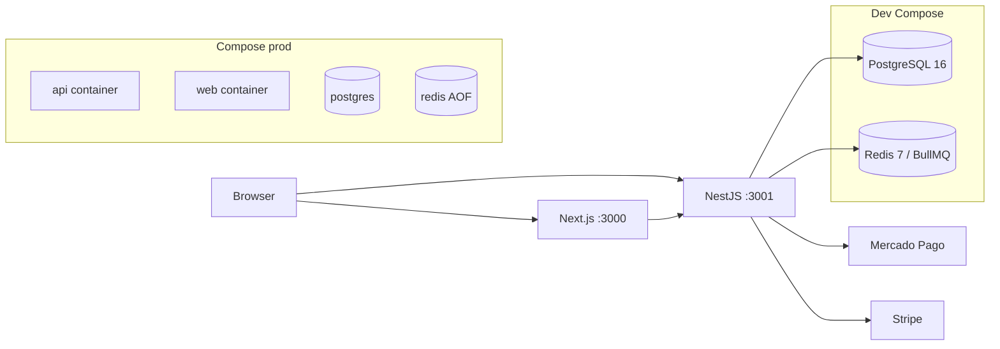

# Agenda Pro — Infrastructure Audit

**Data:** 2026-08-09  
**Agente:** Infraestrutura / DB / DevOps / SRE / Performance  
**Escopo:** working tree; sem commit; sem tocar UI, payments business logic, auth JWT/guards, FSM appointments (Fase 3).

---

## 1. Arquitetura atual

| Camada | Estado pré-infra | Estado pós-infra (este PR working tree) |
|--------|------------------|----------------------------------------|
| PG + Redis local | `docker-compose.yml` | inalterado (dev) |
| App Docker | ausente | `apps/api/Dockerfile`, `apps/web/Dockerfile`, `docker-compose.prod.yml` |
| CI | lint/test/e2e/migrate | + validate, build API/Web, audit soft, docker build API |
| Health | PG only `/api/health` | + Redis informativo; `/api/health/ready` (PG+Redis, 503) |
| Backups | ausente | scripts + `BACKUP.md` / DR |
| Índices | booking OK; gaps CRM/reports/PIX | migration `20260809210000_infra_query_indexes` |

Monorepo npm workspaces; worker BullMQ **no mesmo processo** da API (B-13 permanece).

---

## 2. Problemas encontrados (pré-mudanças)

| ID | Severidade | Problema |
|----|------------|----------|
| I-01 | Alta | Sem Dockerfile / compose de app — deploy só manual |
| I-02 | Alta | Sem backup/restore documentado nem script |
| I-03 | Média | Health sem Redis; LB não distingue ready vs live |
| I-04 | Média | CI sem `next build` / docker build / prisma validate |
| I-05 | Média | Índices faltando para reports/PIX reconcile/CRM soft-delete (AUDIT B-10) |
| I-06 | Média | Redis sem AOF no compose (fila volátil no restart) |
| I-07 | Baixa | Pool Prisma não documentado |
| I-08 | Baixa | Sem RPO/RTO / runbooks |
| I-09 | Info | Observabilidade: Pino ok; sem metrics/Sentry/OTel |
| I-10 | Info | Worker acoplado ao HTTP (pedido Engineering) |

Overlap Fase 3: `appointments.service.ts`, `availability.engine*` — **não alterados**. Só schema índices + docs.

---

## 3. Banco de dados

Ver `DATABASE.md`.

- Multi-tenant por `tenantId` (app-level); sem RLS.
- Soft-delete parcial; LGPD hard-delete em account.
- Migrations: `init` → `phase8_market_parity` → **`infra_query_indexes`**.

---

## 4. Índices

### Já adequados (booking)

- `appointments_professionalId_startsAt_key` (unique)
- `appointments_tenantId_startsAt_idx`
- `appointments_professionalId_startsAt_idx`

### Adicionados (justificados por query)

| Índice | Query |
|--------|-------|
| `appointments (tenantId, status, startsAt)` | `reports.service` groupBy status + range |
| `appointments (status, createdAt)` | `pix-lifecycle` órfãos PENDING_PAYMENT |
| `pix_charges (status, expiresAt)` | `reconcileExpired` PENDING + expiresAt |
| `clients (tenantId, deletedAt)` | CRM list |
| `services (tenantId, deletedAt)` | listagens soft-delete |

### Não adicionados (proposital)

- `notification_jobs(appointmentId)` — sem query atual; ver requests.
- Partial `WHERE deletedAt IS NULL` — Prisma-unfriendly; revisit depois.
- Trigram em `clients.name` — decisão de produto.

---

## 5. Migrations

| Migration | Risco | Notas |
|-----------|-------|-------|
| `20260809210000_infra_query_indexes` | Baixo–médio em tabelas grandes | Só `CREATE INDEX`; ShareLock; sem DROP/ALTER COLUMN |
| `20260809223000_phase4_pix_refunded` | Médio (enum rewrite) | Outro agente — **não criado pelo Infra** |
| `20260809240000_phase5_crm_loyalty` | Médio | Outro agente — CRM/loyalty |

Infra migration **aplicada** no Postgres local (`migrate deploy` OK; índices confirmados via `pg_indexes`).

**Anomalia observada:** `_prisma_migrations` contém linhas extras de `20260809120000_phase8_market_parity` com `finished_at` NULL (provável retry histórico). Não limpar automaticamente — Engineering/ops deve inspecionar antes de mexer na tabela de controle.

**CI fix:** step de migrate deve ser `npm run db:migrate` (script da raiz). `npm run db:migrate -w @agenda-pro/api` falha (script inexistente no workspace).

Procedimento seguro: aplicar em staging → `migrate deploy` em prod em janela leve.  
Rollback índices: `DROP INDEX` dos cinco + remover registro em `_prisma_migrations` (só se necessário).

---

## 6. PostgreSQL

- Imagem: `postgres:16-alpine`
- Volume nomeado; healthcheck `pg_isready`
- Prod-like: sem porta publicada por default (só rede internal) — **nota:** compose prod atual não publica 5432 (bom). API publica 3001.
- Tuning: não feito (default OK para MVP). Próximo: `shared_buffers` / monitoring `pg_stat_statements`.

---

## 7. Redis / BullMQ

- Dev: Redis sem persistência explícita.
- Prod compose: `appendonly yes` + volume.
- Fila `notifications`; falha Redis → jobs ficam no outbox (bom).
- Gap: reconciliação outbox→fila (Engineering M-06).
- Ready exige Redis up (fail-closed para tráfego novo atrás do healthcheck).

---

## 8. Docker

| Artefato | Conteúdo |
|----------|----------|
| `docker-compose.yml` | Dev: PG+Redis (inalterado) |
| `docker-compose.prod.yml` | api+web+pg+redis, depends_on healthy, non-root images |
| `apps/api/Dockerfile` | multi-stage, USER app, HEALTHCHECK ready |
| `apps/web/Dockerfile` | standalone Next, USER app |
| `apps/web/next.config.ts` | `output: 'standalone'` (infra only) |

---

## 9. CI/CD

Pipeline reforçado sem remover steps existentes:

1. npm ci → prisma generate → **validate** → migrate  
2. format / lint / test / e2e  
3. **build API** / **build Web**  
4. **npm audit --audit-level=high** (continue-on-error)  
5. Job **docker build API**

Deploy cloud continua manual (`DEPLOYMENT.md` + `docs/DEPLOY.md`).

---

## 10. Backups

Scripts `scripts/backup-postgres.{ps1,sh}` + restore PS com `-ConfirmRestore` / `-DryRun`.  
Docs: `BACKUP.md`. RPO/RTO: **24h / 2h**.

---

## 11. Disaster recovery

`DISASTER-RECOVERY.md` — runbooks: API / PG / Redis / worker / migration / backup failed.

---

## 12. Observabilidade

**Atual:** Pino + redação; health/ready.  
**Plano (não instalar full stack agora):**

1. Uptime em `/api/health/ready`
2. Alertas 5xx + ready 503
3. Sentry quando houver tráfego real
4. OTel amostrado + dashboard fila (job counts) — pós worker separado

---

## 13. Segurança infra

- Imagens non-root
- Secrets só via env (`.env` gitignored)
- Compose prod: Redis/PG sem publish desnecessário de PG
- Swagger off em prod por default
- Audit npm soft no CI
- **Não** alterado: JWT, cookies, webhooks, RBAC (Engineering Fase 2)

---

## 14. Performance

- Índices reports/PIX/CRM
- Pool documentado (`connection_limit`)
- List appointments `take: 500` → request Engineering (não tocado)
- Sem load test agressivo (missão)

---

## 15. Escalabilidade

| Componente | Limite atual | Próximo passo |
|------------|--------------|---------------|
| API+Worker | 1 processo | Worker split (B-13) |
| PG | single | managed + backups; replicas só com leitura pesada |
| Redis | single | managed / Sentinel depois |
| Web | Vercel ou container | CDN/Vercel ok |
| K8s | prematuro | não |

---

## 16. O que foi feito / não feito

### Feito

- `INFRASTRUCTURE-AUDIT.md`, `DATABASE.md`, `BACKUP.md`, `DISASTER-RECOVERY.md`, `DEPLOYMENT.md`, `INFRA-ENGINEERING-REQUESTS.md`
- Dockerfiles + compose prod
- CI reforçado
- Índices + migration
- Health Redis + `/ready`
- Scripts backup/restore
- `.env.example` pool/health notes
- `next.config` standalone

### Não feito (escopo / risco)

- Separar worker (Engineering)
- RLS / multi-região / K8s
- Sentry/OTel full
- CONCURRENTLY indexes
- Alterar appointments/payments/auth/UI
- PITR / WAL archiving
- Publicar imagem em registry

---

## 17. Requests a outros agentes

Ver `INFRA-ENGINEERING-REQUESTS.md` (M-06 reconciliação, B-13 worker, paginação appointments, waitlist FK, fila depth, trgm opcional).

Fase 3: índices `(tenantId, status, startsAt)` e `(status, createdAt)` suportam list/reports/PIX sem mudar services — **[INFRA → ENGINEERING]** se quiserem usar partial indexes ou EXCLUDE GiST depois.

---

## 18. Riscos restantes

1. Restore nunca testado em staging real até alguém rodar o script.
2. Docker build Web não está no CI job separado (só `next build`); Dockerfile web validar localmente.
3. Alpine HEALTHCHECK depende de `wget` busybox.
4. `npm prune` na imagem API — validar que `@prisma/client` engines estão presentes no build CI docker.
5. Fase 3 mid-edit: migration de índices pode precisar rebase se schema appointments mudar colunas (improvável).
6. Ready=503 sem Redis pode “tirar” API do LB mesmo com HTTP degradado útil — intencional; ajustar se quiser ready só PG.
7. Linhas órfãs em `_prisma_migrations` (phase8 `finished_at` NULL) — higienizar com cuidado em janela controlada.
8. `npm audit` reportou highs no lockfile (CI soft-fail); Engineering pode `npm audit` / upgrades conscientes.

---

## 19. Próximos passos (priorizados)

1. Validar migrate + docker build API neste ambiente  
2. Engineering: reconciliação outbox (M-06)  
3. Backup off-host + restore drill mensal  
4. Worker separado quando notificações forem críticas  
5. Sentry + uptime quando houver tenants pagantes  
6. PITR se RPO &lt; 1h for requisito contratual  

---

## Runbooks (resumo operacional)

| Cenário | Primeira ação | Validação |
|---------|---------------|-----------|
| API down | logs + restart | `/api/health` |
| PG down | restart volume / restore | `pg_isready` + ready |
| Redis down | restart AOF | ready 200; requeue jobs |
| Worker down | restart API | jobs COMPLETED |
| Migration failed | não reset; rollback app | `_prisma_migrations` |
| Backup failed | dry-run + disco | arquivo &gt; 0 + restore test |
